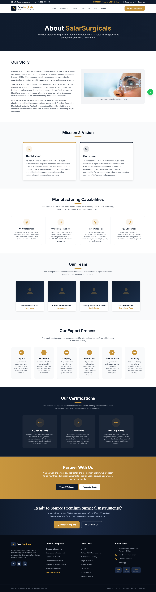
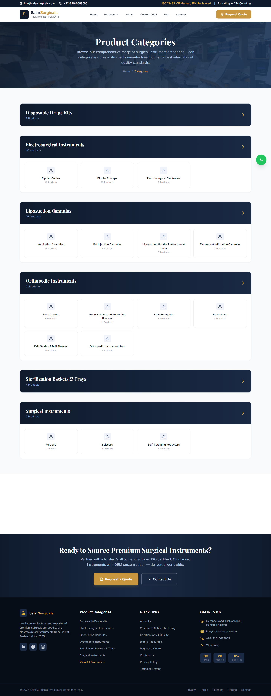
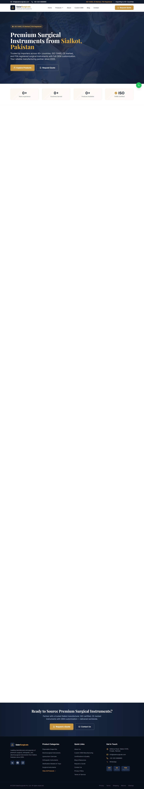
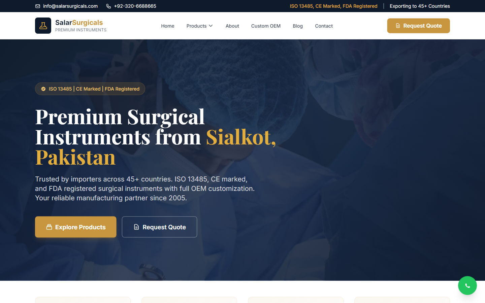
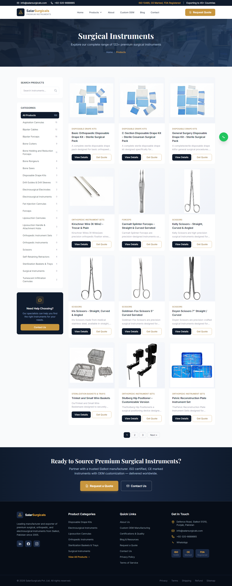

# Salar Surgicals - Surgical Instruments Export Platform

> Catalogue and enquiry platform for a surgical instruments manufacturer, with an admin portal and quote flow.

Built by **[Muhammad Tanveer](https://www.linkedin.com/in/muhammad-tanveer-advenno/)** - Full-Stack AI Automation Engineer.

 

## Contents

- [The problem](#the-problem)
- [The approach](#the-approach)
- [Architecture](#architecture)
- [Tech stack](#tech-stack)
- [Key capabilities](#key-capabilities)
- [Screenshots](#screenshots)
- [Results](#results)
- [FAQ](#faq)
- [Source code and access](#source-code-and-access)
- [About the engineer](#about-the-engineer)
- [Related projects](#related-projects)

## The problem

A surgical instruments manufacturer selling into export markets had no structured way to present a large catalogue or capture enquiries. Buyers could not filter by instrument category, and quote requests arrived as unstructured email.

## The approach

A PHP/MySQL catalogue with an admin portal so staff maintain products without a developer, plus a structured quote-request flow that captures what the buyer actually needs. Product pages are built for search visibility, since export buyers arrive through search rather than direct traffic.

## Architecture

| Component | Responsibility |
| --- | --- |
| **Catalogue** | Category and product browsing with structured attributes |
| **Admin portal** | Product, category and enquiry management |
| **Quote flow** | Structured request-for-quote capture |
| **Mail layer** | Transactional email via PHPMailer |
| **Content pages** | Policy, shipping and company information |

## Tech stack

| Layer | Technology |
| --- | --- |
| Backend | PHP, MySQL |
| Frontend | Server-rendered pages |
| Email | PHPMailer |
| SEO | Structured product pages and sitemaps |

## Key capabilities

- Structured product catalogue
- Admin portal for non-technical staff
- Request-for-quote capture
- Transactional email notifications
- Search-optimised product and category pages

## Screenshots

## Results

- Catalogue maintained by staff rather than through developer requests
- Enquiries arrive structured instead of as free-form email

## FAQ

### Who is the platform for?

A surgical instruments manufacturer selling to international distributors and buyers.

### Can staff update the catalogue?

Yes - the admin portal covers products, categories and enquiries without code changes.

### How are enquiries handled?

A structured quote flow captures requirements and notifies staff by email.

### Is the code public?

No - client project, private repository.

## Source code and access

This repository is the public case study for **Salar Surgicals - Surgical Instruments Export Platform**. The full implementation - application code, database schema, tests and deployment configuration - lives in a **private repository** on this account, alongside the rest of the work shown here.

Source access can be arranged for hiring conversations, technical review or client due diligence. The quickest route is a short message on [LinkedIn](https://www.linkedin.com/in/muhammad-tanveer-advenno/) or an email to [mtanveertahir66@gmail.com](mailto:mtanveertahir66@gmail.com).

## About the engineer

**Muhammad Tanveer - Full-Stack AI Automation Engineer**

Full-stack AI automation engineer. I build agentic systems, browser and workflow automation, RAG pipelines and the production web platforms they run on - from Rust and Python services to Next.js dashboards and PHP/MySQL business systems.

- GitHub: [haddindeve](https://github.com/haddindeve)
- LinkedIn: [Muhammad Tanveer](https://www.linkedin.com/in/muhammad-tanveer-advenno/)
- Email: [mtanveertahir66@gmail.com](mailto:mtanveertahir66@gmail.com)
- Location: Pakistan

## Related projects

- [Concurrent Course Registration System in C](https://github.com/haddindeve/concurrent-course-registration-c)
- [AI Lab Support and Campus Routing Assistant](https://github.com/haddindeve/ai-lab-support-campus-routing)
- [Hafiz Fabrics - Retail POS and ERP](https://github.com/haddindeve/hafiz-fabrics-pos-erp)
- [ARMenu - Augmented Reality Restaurant Menu SaaS](https://github.com/haddindeve/armenu-augmented-reality-menu-saas)
- [ACIP - AI Content Intelligence Platform](https://github.com/haddindeve/bloggen-ai-content-platform)
- [Gym Management CRM with NFC Gate Control](https://github.com/haddindeve/gym-management-crm-system)

---

Salar Surgicals - Surgical Instruments Export Platform - case study by Muhammad Tanveer - Full-Stack AI Automation Engineer. Keywords: surgical instruments manufacturer website, B2B export catalogue, product catalogue CMS, quote request system, manufacturer web platform, PHP admin portal.